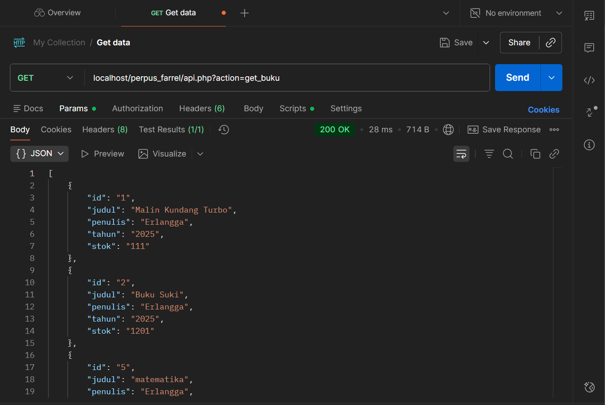
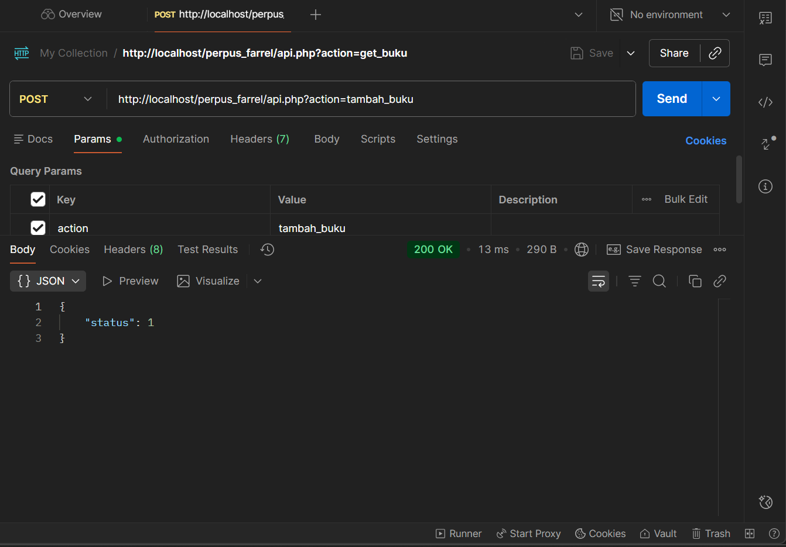
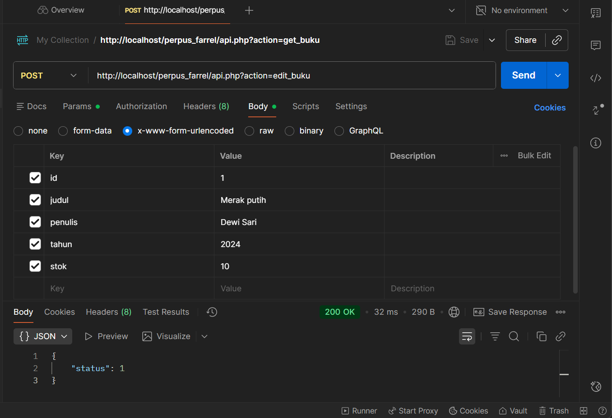
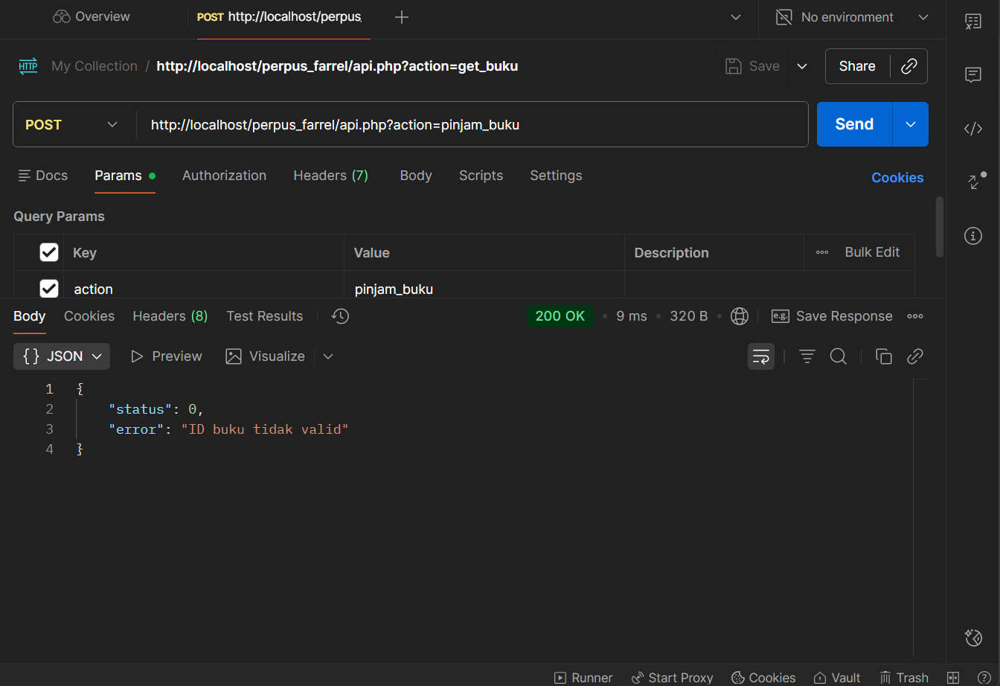
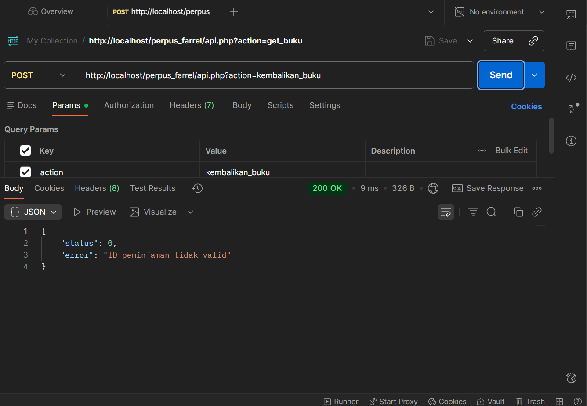
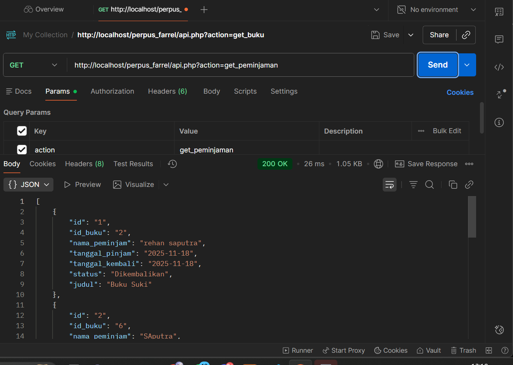

<h1 align="center">📚 Aplikasi Perpustakaan Sederhana (CRUD + API)</h1>

  Project Pengembangan Sistem Perpustakaan Sekolah Menggunakan API Sederhana  

<h2>📌 Pengantar</h2>

Project ini merupakan pengembangan dari project sebelumnya yang dibuat di sekolah. Pada versi ini, saya menambahkan <b>API sederhana</b> untuk:

<ul>
  <li>CRUD Data Buku</li>
  <li>Transaksi Peminjaman Buku</li>
  <li>Transaksi Pengembalian Buku</li>
  <li>Pengujian API menggunakan Postman</li>
</ul>

<h2>📁 Struktur Folder</h2>

<pre>
perpus_farrel/
│── api.php
│── config.php
│── edit_buku.php
│── hapus_buku.php
│── index.php
│── peminjaman.php
│── pengembalian.php
│── proses_peminjaman.php
│── style.css
│── main.js
└── perpusku_123.sql
</pre>

<h2>🚀 Endpoint API</h2>

<h3>1. GET Semua Buku</h3>
<pre>GET /api.php?action=get_buku</pre>

<h3>2. Tambah Buku (CREATE)</h3>
<pre>POST /api.php?action=tambah_buku</pre>

<b>Body:</b>
<ul>
  <li>judul</li>
  <li>penulis</li>
  <li>tahun</li>
  <li>stok</li>
</ul>

<h3>3. Edit Buku (UPDATE)</h3>
<pre>POST /api.php?action=edit_buku</pre>

<h3>4. Hapus Buku (DELETE)</h3>
<pre>POST /api.php?action=hapus_buku</pre>

<h3>5. Peminjaman Buku</h3>
<pre>POST /api.php?action=pinjam_buku</pre>

<h3>6. Pengembalian Buku</h3>
<pre>POST /api.php?action=kembalikan_buku</pre>

<h2>🧪 Pengujian API Menggunakan Postman</h2>

Berikut screenshot hasil pengujian API:

<h3>1. GET Buku</h3>

<h3>2. Tambah Buku</h3>

<h3>3. Edit Buku</h3>

<h3>4. Hapus Buku</h3>

<h3>5. Peminjaman Buku</h3>

<h3>6. Pengembalian Buku</h3>

<h3>7. GET Peminjaman</h3>

<h2>🔧 Cara Menjalankan Project</h2>

<ol>
  <li>Aktifkan XAMPP (Apache & MySQL)</li>
  <li>Import database: <code>perpusku_123.sql</code></li>
  <li>Letakkan folder project di:</li>
</ol>

<pre>C:\xampp\htdocs\perpus_farrel\</pre>

<ol start="4">
  <li>Buka di browser:</li>
</ol>

<pre>http://localhost/perpus_farrel</pre>

<ol start="5">
  <li>Endpoint API:</li>
</ol>

<pre>http://localhost/perpus_farrel/api.php</pre>

<h2>📝 Penjelasan Proses</h2>

Saya melakukan beberapa langkah dalam pengembangan aplikasi ini:

<ul>
  <li>Menambah file <b>api.php</b> sebagai pusat endpoint API</li>
  <li>Membuat operasi CRUD buku</li>
  <li>Membuat API peminjaman dengan stok otomatis berkurang</li>
  <li>Membuat API pengembalian dengan stok otomatis bertambah</li>
  <li>Menguji semua endpoint menggunakan Postman</li>
  <li>Mengupload project ke Git</li>
</ul>

<h2>🎉 Kesimpulan</h2>

Project berhasil dikembangkan dengan menambahkan API CRUD, peminjaman, dan pengembalian buku.
Semua fitur diuji melalui Postman dan berjalan dengan baik.

